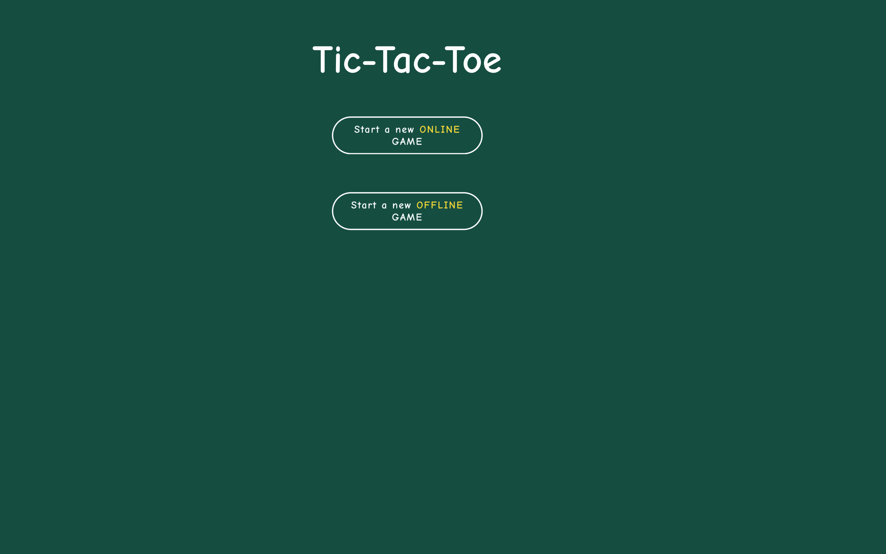
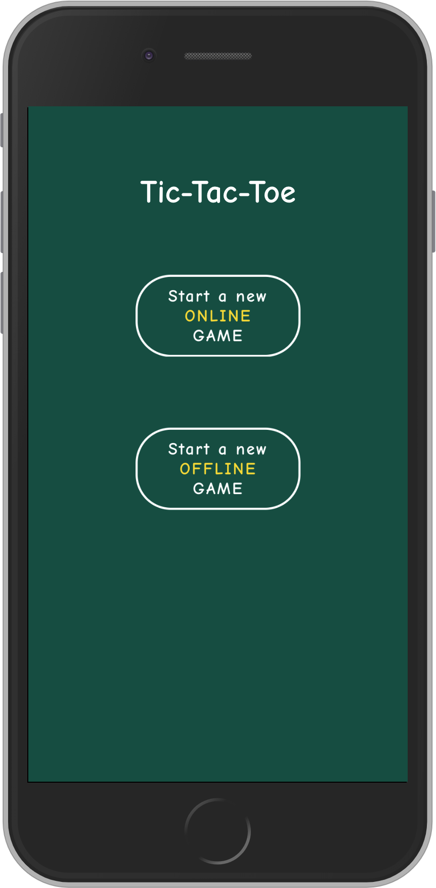
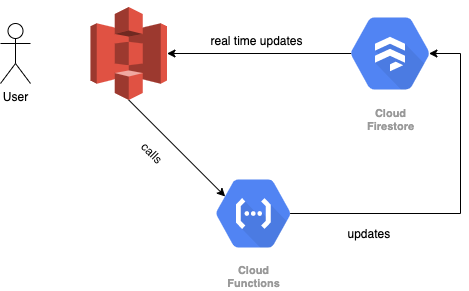
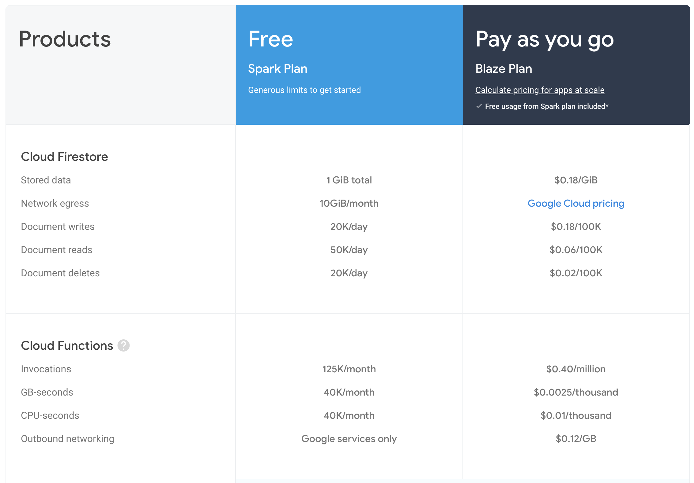

# Game Tic-Tac-Toe


<div align="center">
  
</div>
<div align="center">
  
</div>

### Project structure

- `webapp` contains the PWA hosted on S3
- `cloud-functions` is the cloud functions deployed on firebase

### Project architecture

<div align="center">
  
</div>

- The website if hosted on Amazon S3.
- The user subscribes to Google Cloud Firestore, which is readonly.

```
rules_version = '2';
service cloud.firestore {
  match /databases/{database}/documents {
    match /{document=**} {
      allow read: if request.auth.uid == resource.data.player1.id || request.auth.uid == resource.data.player2.id || resource.data.player1.id == '' || resource.data.player2.id == '';
      allow write: if false;
    }
  }
}
```

- When a user is interacting with the application, cloud functions are triggered.
- The cloud functions will update the Firestore database, and the frontend listeners will display the updated object.


### Scaling


<div align="center">
  
</div>

With the free tier, with an average of 15 invocations per game, we can do `125000 / 15 = 8333 games` per month for free.

After that, we can do `~60k games` for less a dollar. Which is totally fine, especially with some sort of ads.

### Issues

The Google Cloud Functions, as many of other cloud functions, will have a cold boot. This means that if nobody is playing, the first users will suffer a little bit from a slow API. After that it should become fast again.


#### Credits
Icon:
<div>Icons made by <a href="https://www.flaticon.com/authors/freepik" title="Freepik">Freepik</a> from <a href="https://www.flaticon.com/" title="Flaticon">www.flaticon.com</a></div>
